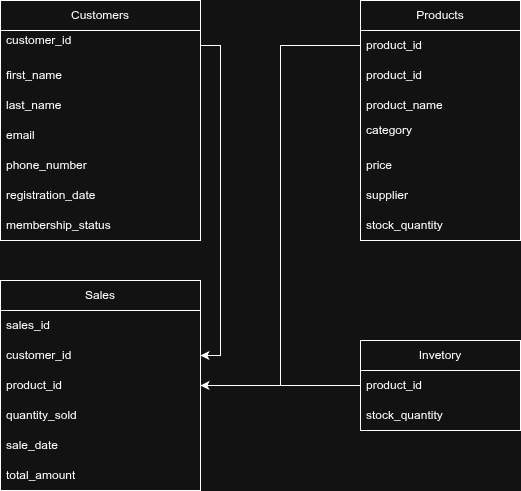

# SQL Assignment: Business Database

## Overview
This project demonstrates relational database design and SQL querying using a sample business scenario. It manages **customers, products, sales, and inventory** data and allows learners to practice complex SQL queries and analysis.

## Database Schema

### Tables
1. **Customers** – Stores customer details: names, email, phone, registration date, membership status.
2. **Products** – Product details: name, category, price, supplier, stock quantity.
3. **Sales** – Sales transactions linking customers and products, including quantity sold, sale date, and total amount.
4. **Inventory** – Tracks stock quantities per product.

### Sample Data
- 50 customers
- 15 products
- 15 sales transactions
- 15 inventory records

This provides realistic data for practicing queries.

## SQL Exercises
Includes **50 exercises** covering:
- Data selection, filtering, and ordering
- Aggregation (SUM, AVG, MIN, MAX, COUNT)
- Joins: inner join and self join
- Grouping and analytical queries
- Date and stock-based analysis